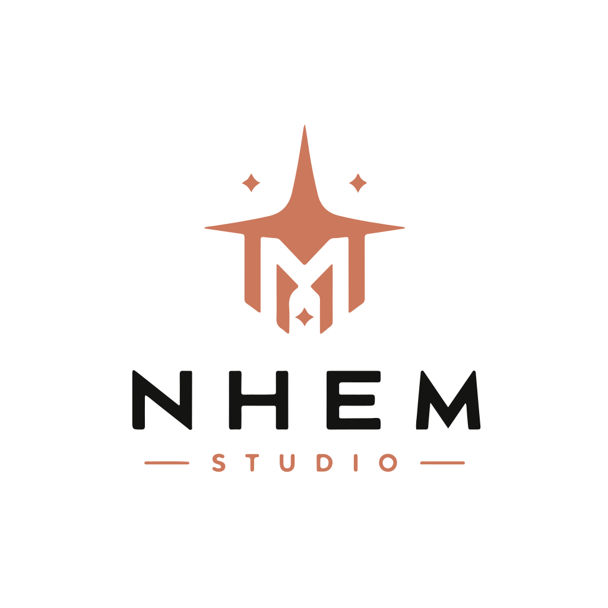

<p align="center">
  <picture>
    <source media="(prefers-color-scheme: dark)" srcset="docs/assets/brand/nhem-studio-logo-dark.svg">
    <source media="(prefers-color-scheme: light)" srcset="docs/assets/brand/nhem-studio-logo-light.svg">
    
  </picture>
</p>

<h1 align="center">NhemDangFugBixs.VContainer.SourceGenerator</h1>

<p align="center">
  <strong>Compile-time VContainer workflow tooling for Unity projects.</strong>
</p>

<p align="center">
  Composition-owned installers · Marker-first scope mapping · Roslyn analyzers · CLI preflight
</p>

---

## Overview

`NhemDangFugBixs.VContainer.SourceGenerator` is a Unity package and Roslyn toolchain for making [VContainer](https://github.com/hadashiA/VContainer) registration safer, cleaner, and more architecture-aware.

It provides:

- Composition-only generated VContainer registration.
- Analyzer diagnostics for invalid DI intent and scope usage.
- Marker-based scope mapping across asmdef boundaries.
- CLI validation through `di-smoke`.
- Unity package assets for runtime attributes, analyzers, docs, and samples.

```txt
Core principle:
Your architecture stays yours.
The package makes it compile-time checked.
```

## Canonical Model

Service assemblies declare DI intent.
Composition assemblies own VContainer registration.

That means:

- Assemblies that only contain `[AutoRegisterIn]` services do not need to reference `VContainer`.
- Assemblies that contain `[LifetimeScopeFor]` are composition targets and emit generated installers.
- Generated installers stay stateless and do not call `Resolve<T>()` during registration.

## Recommended Architecture

```txt
Shared        -> scope markers and contracts
Gameplay      -> services + attributes, no VContainer reference required
Composition   -> LifetimeScopes + VContainer + generated installers
```

Dependency direction:

```txt
Gameplay/Application -> Shared
Infrastructure       -> Shared
Composition          -> Shared + Gameplay/Application + Infrastructure + VContainer
```

Avoid this:

```txt
Gameplay/Application -> Composition
```

## Public API (Phase 1/2)

- `AutoRegisterIn<TScope>` / `AutoRegisterIn(typeof(TScope))`
- `As<TContract>` / `As(typeof(TContract))`
- `AsSelf`
- `LifetimeScopeFor<TScope>` / `LifetimeScopeFor(typeof(TScope))`
- `EntryPoint`
- `RegisterComponentInHierarchy`
- `builder.RegisterGeneratedFor<TScope>()`

Required namespace for the generated extension:

```csharp
using NhemDangFugBixs.VContainer;
```

## Minimal Usage Example

Shared marker:

```csharp
public interface IScopeMarker { }
public interface IGameplayScope : IScopeMarker { }
```

Service asmdef:

```csharp
using NhemDangFugBixs.Attributes;

public interface ICombatCoreService { }

[AutoRegisterIn<IGameplayScope>(Lifetime = NhemLifetime.Scoped)]
[As<ICombatCoreService>]
public sealed class CombatCoreService : ICombatCoreService
{
}
```

Composition asmdef:

```csharp
using NhemDangFugBixs.Attributes;
using NhemDangFugBixs.VContainer;
using VContainer;
using VContainer.Unity;

[LifetimeScopeFor<IGameplayScope>]
public sealed class GameplayLifetimeScope : LifetimeScope
{
    protected override void Configure(IContainerBuilder builder)
    {
        builder.RegisterGeneratedFor<IGameplayScope>();
    }
}
```

Generated registration intent:

```csharp
builder.Register<CombatCoreService>(Lifetime.Scoped)
    .As<ICombatCoreService>();
```

Phase 2 examples:

```csharp
[AutoRegisterIn<IGameplayScope>(Lifetime = NhemLifetime.Scoped)]
[EntryPoint]
public sealed class GameplayLoopEntryPoint : IStartable
{
    public void Start() { }
}
```

```csharp
[AutoRegisterIn<IGameplayScope>(Lifetime = NhemLifetime.Scoped)]
[RegisterComponentInHierarchy]
[As<IPlayerView>]
public sealed class PlayerView : MonoBehaviour, IPlayerView
{
}
```

Generated output:

```csharp
builder.RegisterEntryPoint<GameplayLoopEntryPoint>();

builder.RegisterComponentInHierarchy<PlayerView>()
    .As<IPlayerView>();
```

## Installing

### OpenUPM

```bash
openupm add com.nhemdangfugbixs.tooling
```

### Git URL

```text
https://github.com/NhomNhem/NhemDangFugBixs.Tooling.git?path=/&branch=deploy
```

This package is intended to be installed alongside VContainer in the Unity project.

## Release Gate

Run local release checks:

```powershell
.\scripts\release-gate.ps1
```

With Unity sample compile enabled:

```powershell
$env:UNITY_EXE = "C:\Program Files\Unity\Hub\Editor\<version>\Editor\Unity.exe"
$env:NHEM_UNITY_PROJECT_ROOT = "I:\unityVers\NhemDangFugBixs.Tooling\unity-sample\VContainerSourceGenSample"
.\scripts\release-gate.ps1
```

The release gate runs generator tests, analyzer tests, version drift checks, docs checks, and Unity batchmode compile when Unity is configured.

## Repository Layout

```txt
.
├── Source~/
│   └── C# solution containing generators, analyzers, CLI, and supporting libraries.
├── Runtime/
│   └── Unity runtime attributes and lightweight models.
├── Analyzers/
│   └── Analyzer and source generator assets for Unity.
├── docs/
│   └── Project documentation assets and branding.
├── scripts/
│   └── Local validation and release gate scripts.
└── openspec/
    └── Change proposals, design docs, and implementation tasks.
```

## Design Goals

- Keep service assemblies independent from composition assemblies.
- Keep service assemblies free from direct generated VContainer code.
- Generate readable registration code close to what a senior VContainer user would write by hand.
- Detect invalid DI intent early through analyzers and preflight tooling.
- Stay reusable outside a single game project.

## Non-goals

This package does not aim to:

- Replace VContainer.
- Force one project architecture.
- Generate `LifetimeScope` MonoBehaviours by default.
- Partial-inject into user `LifetimeScope` classes.
- Become a runtime service locator.
- Auto-scan all loaded Unity assemblies for discovery.

## License

Released under the ISC license.

See [LICENSE](LICENSE).
